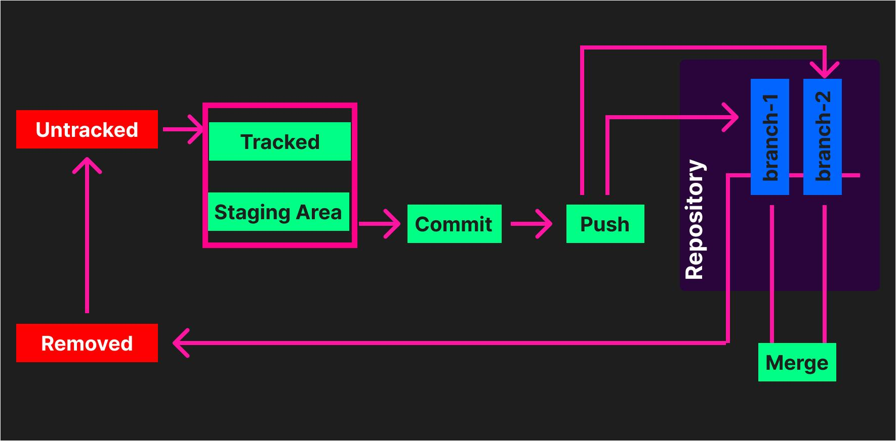

# Some Basic Git commands that you must know.



`⚠ Note:` Don’t try to remember the commands or programming languages. It will be remembered while working. ⚠

`⚠ Note:` To learn Git easily, first, you just use GitHub Desktop to create a repository, commit, and push files. Once you understand how GitHub Desktop works, you can switch to Git, as Git is important and easier to use than GitHub Desktop.

## ▶ What is Git?

Git is a powerful tool for software development and is widely used in the industry. Git is a distributed version control system that allows multiple people to work on a project at the same time without overwriting each other's changes. It was created by Linus Torvalds, the creator of Linux, in 2005.

## ▶ How Git works?
Git tracks changes made to files in a repository so you can see what was changed, who changed it, and when it was changed. It also allows you to revert back to any previous version of your project. 
In addition to this, Git supports branching and merging, which means you can create different versions of your project and then merge them later. This is particularly useful when you want to develop a new feature without affecting the main project [This is a silent killer feature].

### ▶ Now,
Suppose we have a file **“index.html”**. We want to save this file on cloud server Github by Git.


#### *What is Github?*

*GitHub is a web-based hosting service for version control using Git. It is primarily used for computer code. It offers all of the distributed version control and source code management (SCM) functionality of Git as well as adding its own features.*


## ▶ So the process are, 

**1.** First we have to set our “Git” by username and email of “Github” account

**2.** We have to initialize an empty repository

**3.** We have to create a branch [will be created by default when you initialize an empty repository.]

#### *What is branches in Github?*

*A branch in GitHub is essentially a unique set of code changes with a unique name. Each repository can have one or more branches. The main branch (historically known as 'master') is the "default" branch when you create a repository. Use other branches for development and merge them back to the main branch upon completion.*

**4.** Track the untracked files. [Tracked files are managed by “Git”, while untracked files are not managed by “Git”. Consequently, they are not ready for commit. If files aren’t committed, you can’t push them to GitHub.]

**5.** After tracking the files we have to commit [In GitHub, a commit, often referred to as a 'commit message', is the action of saving changes to a repository. It's like a snapshot of your work at a particular point in time.]

**6.** Create a repository on Github 

**7.** Add the repository on “Git” by path. [we have to copy the repository path. By this path, we can push and fetch the files]

**8.** Finally push the files

## ▶ Let’s see the commands,

**1.** `git config user.name mahin` --> to define the username of your “Github” account

**2.** ` git config user.name ` --> check the username

**3.** `git config user.email nimahin25@gmail.com` --> to define the email of your “Github” account

**4.** `git config user.email` --> check the email

**5.** `git init` --> to initialize an empty repository

**6.** A default branch is created (branch name: master). You can change the name of the default branch by `git branch –M mybranch`. [git branch –M < Give your branch any name you wish.>]

**7.** `git status` --> To check the status of files, determine whether they are tracked or untracked. If you want to see the state of all the files, use `git status -s`

**8.** `git add index.html` --> To add this file to the staging area for commiting. (Means the file is now tracking by git). To add many files at once, use `git add -A`

**9.** `git commit index.html` to commit the file. then press “i” of the keyboard and enter your commit message. then press “Esc” and type `:wq` and press enter. Now the file is committed. You can commit many files at once by using `git commit –m added` (`git commit –m <your message>`)

**10.** ` git remote add origin https://github.com/gitmahin/testrepo.git ` --> 
(`git remote add <your repository path>`). *"origin"* is simply a name that you're giving to the URL https://github.com/gitmahin/testrepo.git. It's a shorthand label for the remote repository's URL. However, you could name it anything you want. Once you've added a remote repository with this command, you can refer to it using the name *"origin"* in other Git commands. For example, `git push origin master` would push your changes to the master branch of the *"origin"* repository.

**11.** `git push origin master` --> to push your files to the master branch of your repository path named origin. In this process, you always have to type git push origin master to push your files. But if you type `git push -u origin master`, in the future, you don’t need to type the full command; just type git push, and it will always push your future files to the master branch. (In normal language, we tell our Github that, Git-bro consider our master branch as fixed to push future files. Then Git-bro will accept our wish and tell us that you just use `git push` command to push your files )
Now your files are saved on the GitHub server.

### ▶ More commands:

**1.** `git commit -a -m` --> To add all modified files(!!!not untracked files) to the staging area and commit them at once.

**2.** `git checkout index.html` --> to revert the changes of index.html file: If you've made changes to `index.html` that you're not happy with, or that have caused issues, you can use this command to revert back to the last committed version of the file in the repository.

**3.** `git checkout -f` --> to revert the changes of all files at once

**4.** `git diff` --> to compare what changes are held in the staging area and the working directory.

**5.** `git diff --staged` -->to compare between last commit and staging area

**6.** `git rm index.html` -->to remove the file from both your local storage and repository.

**7.** `git rm --cached index.html` --> to remove the file from repository

**8.** `git log` -->to show all commits

**9.** `git log -p -2` --> to show last 2 commits

**10.** `git branch` --> to list all branches

**11.** `git branch mybranch` --> to create new branch

**12.** `git checkout mybranch` --> to switch mybranch

**13.** `git checkout -b myBranch` --> to create a new branch and switch to it at the same time.

**14.** `git merge hellobranch` --> To merge the code from 'hellobranch' into 'master'(You have to be on the master branch). 

**15.** `git branch -d mybranch` -->to delete mybranch

**16.** `git clone <repository url> <give-your-folder-name>` -->to clone any repository in a folder. You can go with the default by not providing the folder name.

**17.** `git remote –v` --> to show the remote repository

**18.** `git remote rm <your repository path name>` (git remote rm origin) --> to delete the repository.

`⚠ Note:` If you want to keep the files of the 'Master' branch and the new branch separate, you must commit the files created in the 'new' branch. Otherwise, the files created in the 'new' branch will remain in the staging area of the All branch. ⚠

## In Summary

### Authorization

```
git config user.name <your username>

git config user.name

git config user.email <your email>

git config user.email
```

### Initialization

```
git init
```

### Checking Status

```
git status

git status -s
```

### Branch

```
git branch –M <your branch name>

git branch

git branch mybranch

git checkout mybranch

git checkout -b myBranch
```

### Merging Branch

```
git merge hellobranch
```
### Staging Files

```
git add index.html

git add -A
```

### Manual Commit

```
git commit index.html
:wq
```

### Easy Commit
```
git commit –m <your message>
```

### Instant Commit

```
git commit -a -m
```
### Checking commits
```
git log

git log -p -2
```

### Push

```
git remote add origin https://github.com/gitmahin/testrepo.git

git push origin master

git push -u origin master

git push
```

### Restoring Last Commit

```
git checkout index.html

git checkout -f
```

### Comparing

```
git diff

git diff --staged
```

### Checking Active Repository

```
git remote –v
```

### Checking Repository Path Name

```
git remote
```
### Cloning
```
git clone <repository url> <give-your-folder-name>
```
### Unstaging
```
git rm --cached index.html
```

### Delete
```
git remote rm <your repository path name>

git rm index.html

git branch -d mybranch
```


