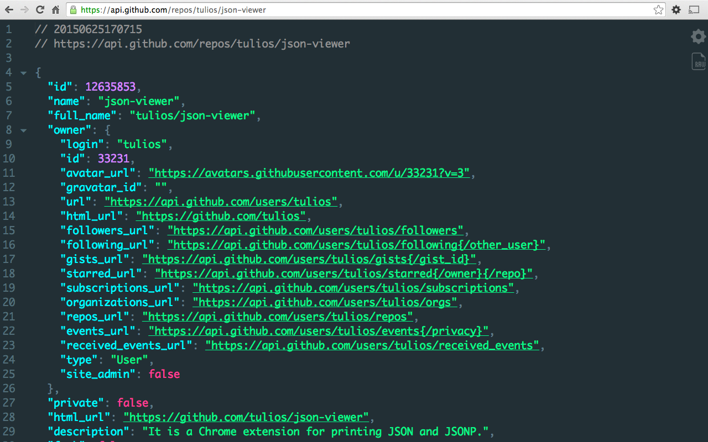

# Chrome Usefull Extensions for programming

## ▶ JSON Viewer

### ⇩ <a href="https://chromewebstore.google.com/detail/gbmdgpbipfallnflgajpaliibnhdgobh">Download the Extension</a>

The most beautiful and customizable JSON/JSONP highlighter that your eyes have ever seen. Open source at https://goo.gl/fmphc7

It is a Chrome extension for printing JSON and JSONP.

Notes:
* This extension might crash with other JSON highlighters/formatters, you may need to disable them

* To highlight local files and incognito tabs you have to manually enable these options on the extensions page
* Sometimes when the plugin updates chrome leaves the old background process running and revokes some options, like the access to local files. When this happen just recheck the option that everything will work again
* Works on local files (if you enable this in chrome://extensions)

## ▶ Pieces for Developers: Copilot & Code Capture

### ⇩ <a href="https://chromewebstore.google.com/detail/pieces-for-developers-cop/igbgibhbfonhmjlechmeefimncpekepm">Download the Extension</a>

Save, share, generate and understand code snippets & concepts to boost your productivity during online research and problem-solving.

Pieces for Developers ⎸Web Extension